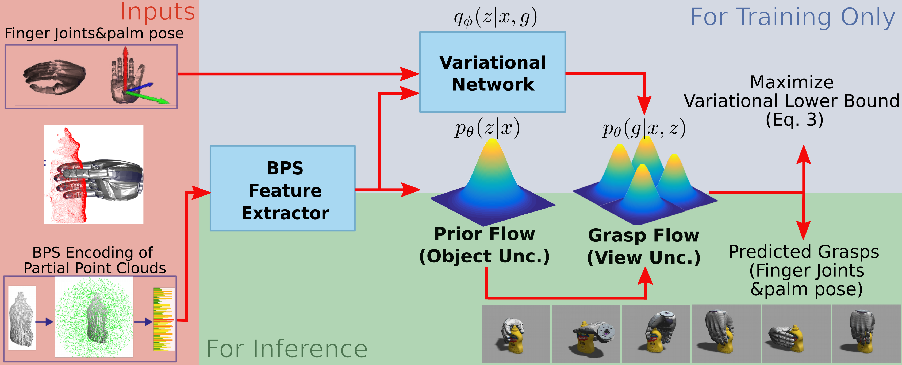

# FFHFlow: Diverse and Uncertainty-Aware Dexterous Grasp Generation via Flow Variational Inference (CoRL 2025)

## Grasp Distribution Visualization


## Model Structure


## Installation

```
conda env create -f environment.yml
```

After the installation is complete you can activate the conda environment by running:
```
conda activate prohmr
```
Install missing packages from pip.
```
pip install -r requirements.txt
```
Installing customized nflow package:
``` 
git submodule update --init --recursive
```

``` 
cd dependencies/nflows & pip install -e .
```

The last step is to install prohmr as a Python package. This will allow you to import it from anywhere in your system.
Since you might want to modify the code, we recommend installing as follows:
```
python setup.py develop
```

if normflows packages cannot be properly installed
```
git clone https://github.com/qqianfeng/normalizing-flows.git
cd normalizing-flows
python setup.py install
```

## Download dataset
Check repo of [FFHNet](https://github.com/qianbot/FFHNet)

## Train

### Train ffhflow-cnf
```
python3 train.py --model_cfg ffhflow/configs/ffhflow_cnf.yaml 
```
### Train ffhflow-lvm
```
python3 train.py --model_cfg ffhflow/configs/ffhflow_lvm.yaml
```

### checkpoints

```
https://drive.google.com/file/d/17v42v2G1bLY14RnHjGXFoc94jb6WdUll/view?usp=sharing
```

## Eval

### Eval ffhflow-cnf
```
python3 eval.py --model_cfg checkpoints/flow_cnf_lr1e-4_RND2/hparams.yaml
```

### Eval lvffhflow-lvm
```
python3 eval.py --model_cfg checkpoints/flow_lvm_lr1e-4_RND-1_lx0260/hparams.yaml
```

## Folder structure
```
├── data
│   ├── eval_batch_correct_eval.pth
│   ├── eval_batch.pth
│   ├── obj_names_cnf_sim.npy
│   ├── obj_names_lvm.npy
│   ├── tsne_obj_names_lvm_bps_feat_oldeval.npy
│   ├── tsne_output_cnf_sim.npy
│   ├── tsne_output_lvm_bps_feat_oldeval.npy
│   └── tsne_output_lvm.npy
├── dependencies
│   └── normflows
├── ffhflow
│   ├── __init__.py
│   ├── backbones
│   │   ├── __init__.py
│   │   ├── ffhgenerator.py
│   │   ├── pointnet.py
│   │   └── vae.py
│   ├── configs
│   │   ├── __init__.py
│   │   ├── ffhflow_cnf.yaml
│   │   ├── ffhflow_lvm.yaml
│   ├── datasets
│   │   ├── __init__.py
│   │   ├── dataloader.py
│   ├── ffhflow_cnf.py
│   ├── ffhflow_lvm.py
│   ├── heads
│   │   ├── __init__.py
│   │   ├── ffhflow_lvm_head.py
│   │   ├── glow.py
│   │   ├── pe.py
│   └── utils
│       ├── __init__.py
│       ├── definitions.py
│       ├── grasp_data_handler.py
│       ├── losses.py
│       ├── metrics.py
│       ├── train_utils.py
│       ├── utils.py
│       ├── vis_angle_vector.py
│       └── visualization.py
├── README.md
├── environment.yml
├── requirements.txt
├── scripts
│   ├── bps_encode.py
│   ├── bps_encode.sh
├── setup.py
├── train.py
├── eval.py
└── t-sne_visualizer.py
```
